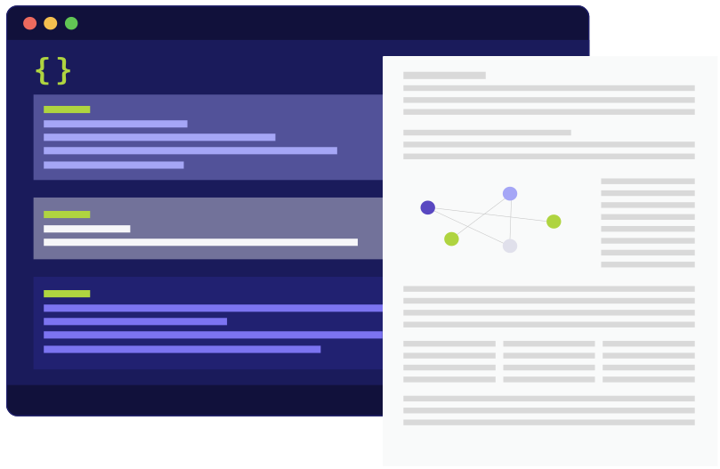

<div align="center">


<br/>
<br/>

Codifying and automating mission-critical communications with standardized and reusable templates.

[Releases](https://github.com/blackstork-io/fabric/releases) | [Docs](https://blackstork.io/fabric/docs/) | [Slack](https://fabric-community.slack.com/)


[](https://fabric-community.slack.com/)

</div>

> [!NOTE]  
> Fabric is currently in the early stages of development, and there may be some issues. If you have any suggestions, ideas, or encounter bugs, please share them in [Fabric Community slack](https://fabric-community.slack.com/).

Fabric is an open-source CLI tool and a configuration language that codifies and automates of the content generation process.

<div align="center">
    
</div>

Fabric produces Markdown documents from the templates that define data requirements and content structure. The templates are written in Fabric Configuration Language and consist of reusable blocks, powered by plugins.
Data blocks fetch data from various external sources -- data stores, security solutions, and platforms. The content blocks render the template into a Markdown document.

See [Documentation](https://blackstork.io/fabric/docs/) for more details on the Fabric language and Fabric CLI.

# Installation

To get started with Fabric, follow these simple steps for installation across various operating systems:

- **download release archives**: choose and download the appropriate release for your operating system (Windows, macOS/Darwin, or Linux) and architecture in ["Releases" section](https://github.com/blackstork-io/fabric/releases);
- **unpack the archives**: extract the contents of the downloaded archives to a preferred directory;

That's it! You're now ready to use Fabric. For more details on usage and configuration options, refer to the "Usage" paragraph below or [Fabric CLI](https://blackstork.io/fabric/docs/cli) documentation.

# Usage

The command line interface to Fabric is `fabric` CLI tool. It supports two sub-commands:

- `data` — executes the data block and prints out prettified JSON to standard output.
- `render` — renders the specified target (a document template) into Markdown and outputs the result to standard output or to a file.

```text
$ fabric --help

Usage:
  fabric [command]

Available Commands:
  completion  Generate the autocompletion script for the specified shell
  data        Execute a single data block
  help        Help about any command
  render      Render the document

Flags:
      --color                enables colorizing the logs and diagnostics (if supported by the terminal and log format) (default true)
  -h, --help                 help for fabric
      --log-format string    format of the logs (plain or json) (default "plain")
      --log-level string     logging level ('debug', 'info', 'warn', 'error') (default "info")
      --plugins-dir string   override for plugins dir from fabric configuration
      --source-dir string    a path to a directory with *.fabric files (default ".")
  -v, --verbose              a shortcut to --log-level debug
      --version              version for fabric

Use "fabric [command] --help" for more information about a command.
```

## Source directory

Fabric loads `*.fabric` files from a source directory. By default, the current directory (`.`) is a source directory. If you wish to specify a different location, use `--source-dir` argument when running `fabric`.

# Documentation

Visit [https://blackstork.io/fabric/docs/](https://blackstork.io/fabric/docs/) for full documentation.

# Security

Please report any suspected security vulnerabilities through GitHub's [security advisory reporting](https://github.com/blackstork-io/fabric/security/advisories/new). We treat every report with utmost seriousness and will conduct a comprehensive investigation.

We kindly request that you talk to us before making any public disclosures. This ensures that no excessive information is revealed before a patch is ready and users have enough time to upgrade.

# License

Fabric is licensed under Apache-2.0 license. See the [LICENSE](LICENSE) file for the details.
