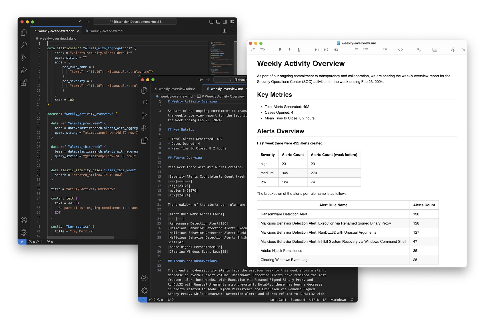

<div align="center">


<br/>
<br/>

[Releases](https://github.com/blackstork-io/fabric/releases) | [Docs](https://blackstork.io/fabric/docs/) | [Slack](https://fabric-community.slack.com/)


[](https://fabric-community.slack.com/)

</div>

**Fabric** is an open-source Command-Line Interface (CLI) tool with a configuration language designed to encode and automate content generation for cybersecurity and compliance.

<div align="center">
    
</div>

Fabric generates documents from templates written in [Fabric Configuration Language](https://blackstork.io/fabric/docs/language/) (FCL). The templates are modular and reusable. By including data requirements and content structure definitions in the templates, the template authors can significantly reduce the manual effort of data consolidation and document build-up.

See [Tutorial](https://blackstork.io/fabric/docs/tutorial/) for an introduction to FCL and Fabric.

Fabric templates can include static content, dynamic templates (powered by Go templates) or rely on
GenAI for content generation (with [`openai`](https://blackstork.io/fabric/docs/plugins/openai/) plugin, for example).

> [!NOTE]  
> Fabric is currently in the early stages of development, and there may be some issues. If you have any suggestions, ideas, or bug reports, please share them in [Fabric Community slack](https://fabric-community.slack.com/).

## Plugins

Fabric supports plugins that offer integrations with various platforms, data stores, and security solutions, including [JSON/CSV files](https://blackstork.io/fabric/docs/plugins/builtin/), [Elastic](https://blackstork.io/fabric/docs/plugins/elastic/), [OpenCTI](https://blackstork.io/fabric/docs/plugins/opencti/), [Splunk Cloud](https://blackstork.io/fabric/docs/plugins/splunk/), [GitHub](https://blackstork.io/fabric/docs/plugins/github/), and more.

You can find the full list of supported plugins in [the documentation](https://blackstork.io/fabric/docs/plugins/).

## Templates

You can find open-source templates for CTI, pentesting and SecOps use cases in [Fabric Templates](https://github.com/blackstork-io/fabric-templates) repository.

## Installing Fabric

### Homebrew

To install Fabric on macOS with [Homebrew](https://brew.sh/), run these commands:

```bash
# Install Fabric from the tap
brew install blackstork-io/tools/fabric

# Verify the version installed
fabric --version
```

The tap is updated automatically with every release.

### Docker

The Docker images for Fabric are hosted in [Docker Hub](https://hub.docker.com/r/blackstorkio/fabric/tags).

To run Fabric as a Docker image use a name `blackstorkio/fabric`:

```bash
docker run blackstorkio/fabric
```

### GitHub releases

Fabric binaries for Windows, macOS, and Linux are available at ["Releases"](https://github.com/blackstork-io/fabric/releases) page in the project's GitHub.

To install Fabric:

- **download a release archive**: choose and download Fabric release archive appropriate for your operating system (Windows, macOS/Darwin, or Linux) and architecture from ["Releases"](https://github.com/blackstork-io/fabric/releases) page;
- **unpack**: extract the contents of the downloaded release archive into a preferred directory;

For example, the steps for macOS (arm64) are:

```bash
# Create a folder
mkdir fabric-bin

# Download the latest release of Fabric
wget https://github.com/blackstork-io/fabric/releases/latest/download/fabric_darwin_arm64.tar.gz -O ./fabric_darwin_arm64.tar.gz

# Unpack Fabric release archive into `fabric-bin` folder
tar -xvzf ./fabric_darwin_arm64.tar.gz -C ./fabric-bin

# Verify that `fabric` runs
./fabric-bin/fabric --help
```

## Usage

The core `fabric` commands are:

- `install` — install all plugins listed as required in the configuration (see
  [Configuration](https://blackstork.io/fabric/docs/language/configs/)).
- `data` — executes the data block and prints out prettified JSON to standard output (see [Data
  blocks](https://blackstork.io/fabric/docs/language/data-blocks/)).
- `render` — renders a document template and prints out the result to standard output or a file.

For more details, run `fabric --help`:

```text
$ ./fabric --help
Usage:
  fabric [command]

Available Commands:
  completion  Generate the autocompletion script for the specified shell
  data        Execute a single data block
  help        Help about any command
  install     Install plugins
  render      Render the document

Flags:
      --color               enables colorizing the logs and diagnostics (if supported by the terminal and log format) (default true)
  -h, --help                help for fabric
      --log-format string   format of the logs (plain or json) (default "plain")
      --log-level string    logging level ('debug', 'info', 'warn', 'error') (default "info")
      --source-dir string   a path to a directory with *.fabric files (default ".")
  -v, --verbose             a shortcut to --log-level debug
      --version             version for fabric

Use "fabric [command] --help" for more information about a command.
```

## Documentation

Visit [https://blackstork.io/fabric/docs/](https://blackstork.io/fabric/docs/) to see full documentation for Fabric.

## Security

If you suspect any vulnerabilities within Fabric, please report them using GitHub's [security
advisory reporting](https://github.com/blackstork-io/fabric/security/advisories/new). We treat every
report with the utmost seriousness and commit to conducting a thorough investigation.

We kindly request that you task with us before making any public disclosures. This precautionary
step ensures that no excessive information is shared prematurely, allowing us to prepare a patch.
It also gives users enough time to upgrade.

## License

Fabric is licensed under Apache-2.0 license. See the [LICENSE](LICENSE) file for the details.
