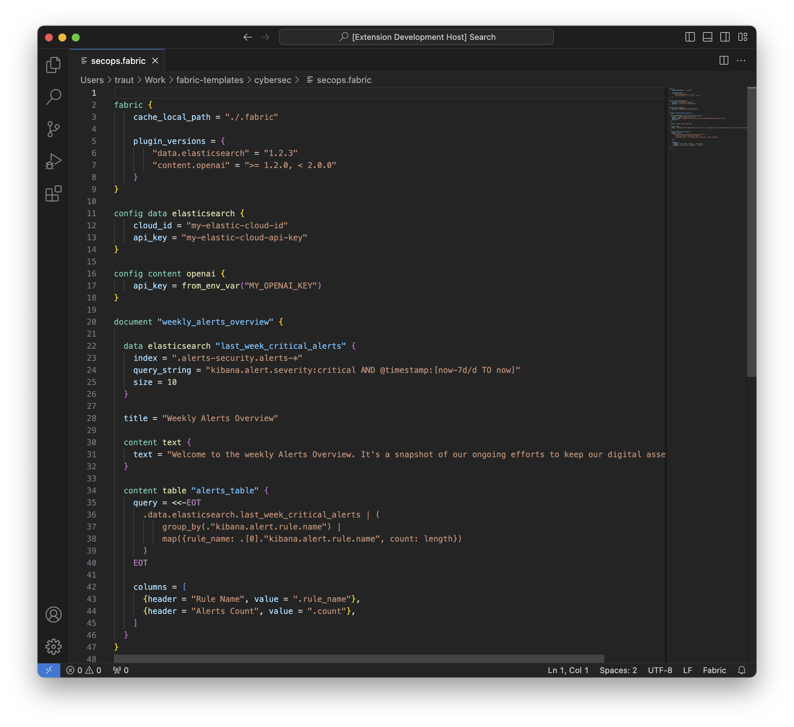

# Fabric configuration language

Fabric Configuration Language (FCL) serves as the core feature for Fabric — a powerful tool designed to streamline document generation. FCL enables users to express data requirements and template structures within configuration files with lightweight syntax.

The document templates defined in the configuration files act as blueprints for data consolidation and creation of Markdown documents.

FCL empowers users to define, manage, and automate the document production process, delivering a sturdy and adaptable solution for content generation.

Fabric configuration files have extension `.fabric` and contain configurations, data requirements and content definitions. Fabric configuration codebase can consist of many files and sub-directories.

## Core concepts

Similar to [Terraform Configuration Language](https://developer.hashicorp.com/terraform/language), Fabric language builds upon [HashiCorp Configuration Language](https://github.com/hashicorp/hcl) (HCL), and consists of two core elements:

- **Blocks** are containers that define an object, like a configuration, a data requirement or a content structure. Blocks always have a block type and zero or more labels.
- **Arguments** assign a value to a name inside a blocks.

```hcl
# Named data block:

data elasticsearch "alerts" {
    index = ".alerts-security.alerts-*"
    query_string = "kibana.alert.severity:critical"
}

<BLOCK-TYPE> <PLUGIN> "<BLOCK-NAME>" {
    <ARGUMENT> = <VALUE>
}


# Anonymous configuration block for a data plugin:

config data elasticsearch {
    cloud_id = "my-elastic-cloud-id"
    api_key = "my-elastic-cloud-api-key"
}


<CONFIG-LABEL> <BLOCK-TYPE> <PLUGIN> {
    <ARGUMENT> = <VALUE>
}
```

See [Syntax](./syntax/) for more details on the FCL syntax.

## IDE support

Since Fabric configuration language builds on HCL, IDE extensions for HCL syntax highlighting will work with Fabric files as well. You might need to explicitly set a file type for `*.fabric` files to HCL.

If you are using Microsoft Visual Studio Code, take a look at [Fabric Extension for Visual Studio Code](https://github.com/blackstork-io/vscode-fabric).


